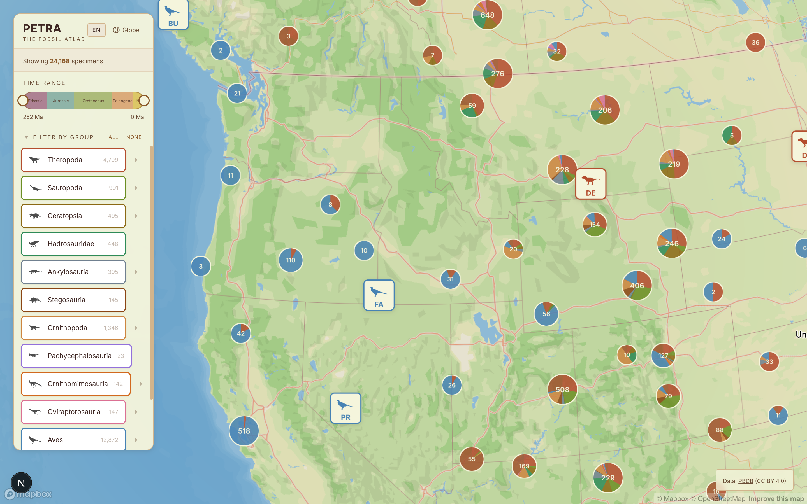
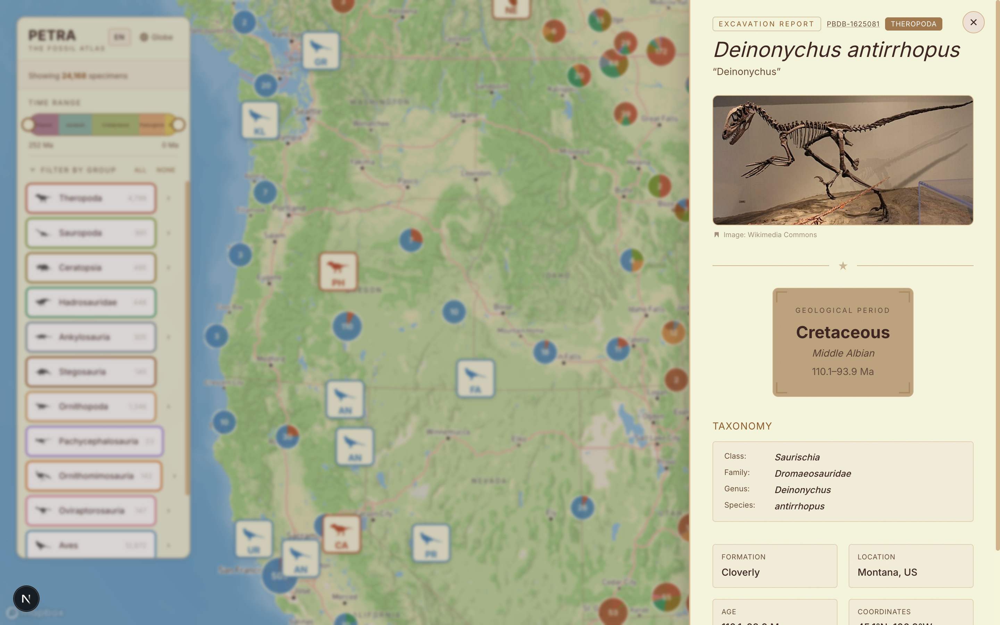
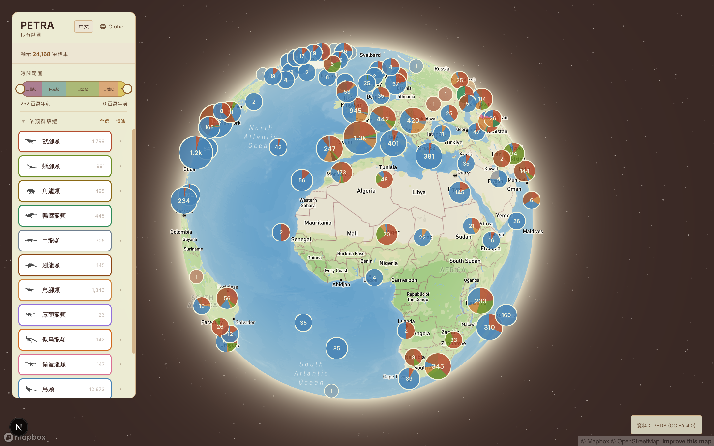

# PETRA — The Fossil Atlas 🦕

An interactive 3D globe visualizing **~24,000 dinosaur fossil discoveries** worldwide, with full **Chinese/English bilingual support**. Powered by real data from the [Paleobiology Database](https://paleobiodb.org/).


## Features

### 3D Globe with Clustering
Fossils are grouped into pie-chart clusters at low zoom, color-coded by taxonomic group. Zoom in to explore individual fossil cards across continents.



### Excavation Reports
Click any fossil to open a detailed report with Wikipedia images, taxonomy, geological period, formation, and a direct link to the PBDB record.



### Geological Time Filter
Dual-handle time range slider spanning the Triassic (252 Ma) to present, with ICS standard period colors. Filter fossils by geological age in real time.

### Bilingual Support (EN / 中文)
Auto-detects browser language with manual toggle. Includes 586 Chinese dinosaur genus names, 451 family names, and 140+ geological stage translations — all sourced from Wikipedia and reviewed for accuracy.



### Additional Features
- Toggle between 3D Globe and 2D Mercator projections
- Filter by 13 taxonomic groups with expandable sub-family breakdown
- ICS-standard color-coded geological period badges
- Parchment-themed archaeological aesthetic
- Fully responsive mobile layout

## Tech Stack

- **Next.js 15** / React 19
- **Mapbox GL** — 3D globe, clustering, terrain
- **Framer Motion** — slide-in panels, transitions
- **Tailwind CSS** — custom Petra color palette (parchment, sepia, sienna, sand, bone)

## Getting Started

```bash
# Install dependencies
npm install

# Set up your Mapbox token
cp .env.local.example .env.local
# Edit .env.local and add your token

# Start dev server
npm run dev
```

## Data

Fossil data is sourced from the [Paleobiology Database](https://paleobiodb.org/) (CC BY 4.0). The dataset includes all Dinosauria occurrences with coordinates, stratigraphy, and taxonomy, classified into 13 groups: theropods, sauropods, ceratopsians, hadrosaurs, ankylosaurs, stegosaurs, ornithopods, pachycephalosaurs, ornithomimosaurs, oviraptorosaurs, birds, trace fossils, and unclassified.

To refresh the data:

```bash
npm run fetch-data
```

## License

Fossil data: [Paleobiology Database](https://paleobiodb.org/) (CC BY 4.0)
